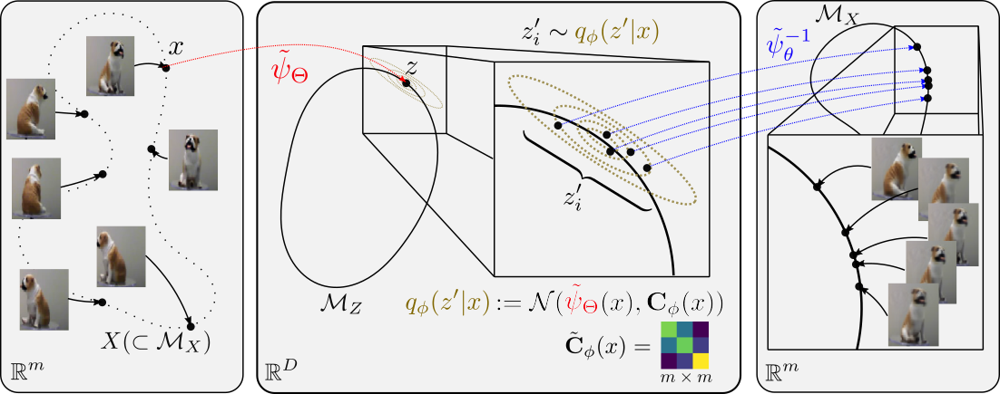

### DVAE
Diffusion Variational Auto Encoder is a generative model that combines ideas from spectral manifold learning and variational inference.

A diagram depicting one step of the diffusion process modeled by the variational diffusion autoencoder (VDAE). The diffusion and inverse diffusion maps \$\psi, \psi^{-1}\$, as well as the covariance $\mathbf{C}$ of the random walk on $\mathcal{M}_Z$, are all approximated by neural networks. Images on the leftmost panel are actually generated by our method
### Installation from GitHub
git clone 
python setup.py install --user

### Acknowledgements and References
If you find our library useful in your research, please consider citing us:

@article{li2019variational,
  title={Variational Diffusion Autoencoders with Random Walk Sampling},
  author={Li, Henry and Lindenbaum, Ofir and Cheng, Xiuyuan and Cloninger, Alexander},
  journal={arXiv preprint arXiv:1905.12724},
  year={2019}
}

